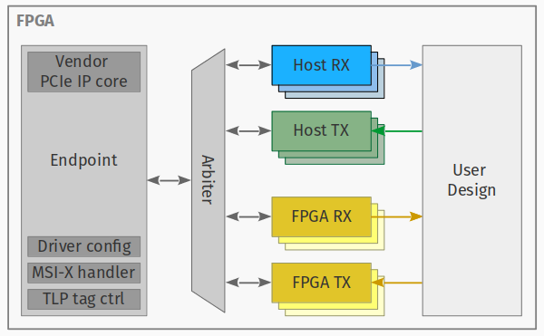

VerCoLib-PCIe
=============

The **Ver**satile **Co**mmunication **Lib**rary is a collection of VHDL modules to enable DMA data transfer over PCIe.



### Capabilities

VerCoLib-PCIe supports PCIe-2.1 and includes a ready-to-use configuration for the Xilinx VC707-Development board.

### Getting Started

The transceiver is split into one endpoint interfacing directly to the PCIe bus
and a number of channel modules interfacing with the user design.
See [our paper](https://www.ti.uni-bonn.de/static/research/publications/arc_2018_vercolib.pdf) for details.

For simple toplevel systems to build upon, see the [examples section](./examples).

The public types, functions and modules are documented in the main package files:
[pcie.vhd](./hardware/src/pcie.vhd) and [pcie_utilities.vhd](./hardware/src/pcie_utilities.vhd).


### Adding VerCoLib PCIe to an existing Vivado Project
Run from the Vivado Tcl command line:
```tcl
source ~/path/to/vercolib_pcie/scripts/add_vercolib_pcie.tcl
```

### Creating a Vivado project for an example system
From command line (linux):
```bash
cd path/to/vivado_projects/
vivado -mode batch -source path/to/vercolip_pcie/examples/<example_name>/create_project.tcl
```

From the Vivado GUI:
```tcl
cd path/to/vivado_projects
source path/to/vercolib_pcie/examples/<example_name>/create_project.tcl
```


### Dependencies
For Simulation:
* ModelSim (other Simulators with  VHDL-2008 support should also work)
* VUnit

For Synthesis:
* Vivado 2017.4 or 2018.3


Citation
--------
```
@InProceedings{10.1007/978-3-319-78890-6_7,
author="Sezenlik, O{\u{g}}uzhan
and Sch{\"u}ller, Sebastian
and Anlauf, Joachim K.",
title="VerCoLib: Fast and Versatile Communication for FPGAs via PCI Express",
booktitle="Applied Reconfigurable Computing. Architectures, Tools, and Applications",
year="2018",
publisher="Springer International Publishing",
pages="81--92",
isbn="978-3-319-78890-6"
}

```

License
-------

VerCoLib PCIe is licensed under the BSD 3-clause license.

Contact
-------

```
Oguzhan Sezenlik <sezenlik@cs.uni-bonn.de>
Sebastian Schüller <schueller@ti.uni-bonn.de>
University of Bonn - Technical Computer Science
```
